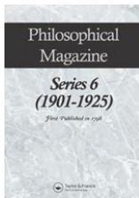

This article was downloaded by: [German National Licence 2007]

On: 18 November 2010

Access details: Access Details: [subscription number 777306420]

Publisher Taylor & Francis

Informa Ltd Registered in England and Wales Registered Number: 1072954 Registered office: Mortimer House, 37-41 Mortimer Street, London W1T 3JH, UK

# Philosophical Magazine Series 6

Publication details, including instructions for authors and subscription information:

http://www.informaworld.com/smpp/title~content=t910323447

# I. On the constitution of atoms and molecules

N. Bohr

To cite this Article Bohr, N.(1913) 'I. On the constitution of atoms and molecules', Philosophical Magazine Series 6, 26: 151, 1 – 25

To link to this Article: DOI: 10.1080/14786441308634955

URL: http://dx.doi.org/10.1080/14786441308634955

# PLEASE SCROLL DOWN FOR ARTICLE

Full terms and conditions of use: http://www.informaworld.com/terms-and-conditions-of-access.pdf

This article may be used for research, teaching and private study purposes. Any substantial or systematic reproduction, re-distribution, re-selling, loan or sub-licensing, systematic supply or distribution in any form to anyone is expressly forbidden.

The publisher does not give any warranty express or implied or make any representation that the contents will be complete or accurate or up to date. The accuracy of any instructions, formulae and drug doses should be independently verified with primary sources. The publisher shall not be liable for any loss, actions, claims, proceedings, demand or costs or damages whatsoever or howsoever caused arising directly or indirectly in connection with or arising out of the use of this material.