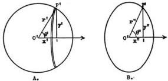
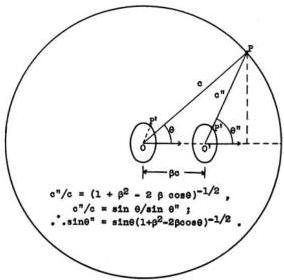

SCATTERING OF X-RAYS BY LIGHT ELEMENTS

487

where

$$\alpha = h\nu_0/mc^2 = h/mc\lambda_0. \tag{4}$$

Or in terms of wave-length instead of frequency,

$$\lambda_\theta = \lambda_0 + (2h/mc) \sin^2 \frac{1}{2}\theta. \tag{5}$$

It follows from Eq. (2) that $1/(1 - \beta^2) = \{1 + \alpha[1 - (\nu_\theta/\nu_0)]\}^2$, or solving explicitly for $\beta$

$$\beta = 2\alpha \sin \frac{1}{2}\theta \frac{\sqrt{1 + (2\alpha + \alpha^2) \sin^2 \frac{1}{2}\theta}}{1 + 2(\alpha + \alpha^2) \sin^2 \frac{1}{2}\theta}. \tag{6}$$

Eq. (5) indicates an increase in wave-length due to the scattering process which varies from a few per cent in the case of ordinary X-rays to more than 200 per cent in the case of $\gamma$-rays scattered backward. At the same time the velocity of the recoil of the scattering electron, as calculated from Eq. (6), varies from zero when the ray is scattered directly forward to about 80 per cent of the speed of light when a $\gamma$-ray is scattered at a large angle.

It is of interest to notice that according to the classical theory, if an X-ray were scattered by an electron moving in the direction of propagation at a velocity $\beta'c$, the frequency of the ray scattered at an angle $\theta$ is given by the Doppler principle as

$$\nu_\theta = \nu_0 / \left(1 + \frac{2\beta'}{1 - \beta'} \sin^2 \frac{1}{2}\theta\right). \tag{7}$$

It will be seen that this is of exactly the same form as Eq. (3), derived on the hypothesis of the recoil of the scattering electron. Indeed, if $\alpha = \beta'/(1 - \beta')$ or $\beta' = \alpha/(1 + \alpha)$, the two expressions become identical. It is clear, therefore, that so far as the effect on the wave-length is concerned, we may replace the recoiling electron by a scattering electron moving in the direction of the incident beam at a velocity such that

$$\bar{\beta} = \alpha/(1 + \alpha). \tag{8}$$

We shall call $\bar{\beta}c$ the "effective velocity" of the scattering electrons.

Energy distribution from a moving, isotropic radiator.—In preparation for the investigation of the spatial distribution of the energy scattered by a recoiling electron, let us study the energy radiated from a moving, isotropic body. If an observer moving with the radiating body draws a sphere about it, the condition of isotropy means that the probability is equal for all directions of emission of each energy quantum. That is, the probability that a quantum will traverse the sphere between the angles $\theta'$ and $\theta' + d\theta'$ with the direction of motion is $\frac{1}{2} \sin \theta' d\theta'$. But

488

ARTHUR H. COMPTON

the surface which the moving observer considers a sphere (Fig. 2A) is

Fig. 2

considered by the stationary observer to be an oblate spheroid whose polar axis is reduced by the factor $\sqrt{1 - \beta^2}$. Consequently a quantum of radiation which traverses the sphere at the angle $\theta'$, whose tangent is $y'/x'$ (Fig. 2A), appears to the stationary observer to traverse the spheroid at an angle $\theta''$ whose tangent is $y''/x''$ (Fig. 2B). Since $x' = x''/\sqrt{1 - \beta^2}$ and $y' = y''$, we have

$$\tan \theta' = y'/x' = \sqrt{1 - \beta^2} y''/x'' = \sqrt{1 - \beta^2} \tan \theta'', \tag{9}$$

and

$$\sin \theta' = \frac{\sqrt{1 - \beta^2} \tan \theta''}{\sqrt{1 + (1 - \beta^2) \tan^2 \theta''}}. \tag{10}$$

Fig. 3. The ray traversing the moving spheroid at $P'$ at an angle $\theta''$ reaches the stationary spherical surface drawn about $O$, at the point $P$, at an angle $\theta$.