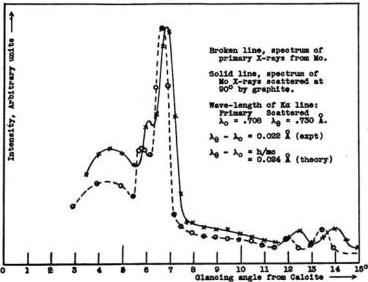

SCATTERING OF X-RAYS BY LIGHT ELEMENTS

495

the secondary. The zero point for the spectrum of both the primary and secondary X-rays was determined by finding the position of the first order lines on both sides of the zero point.

Fig. 4. Spectrum of molybdenum X-rays scattered by graphite, compared with the spectrum of the primary X-rays, showing an increase in wave-length on scattering.

It will be seen that the wave-length of the scattered rays is unquestionably greater than that of the primary rays which excite them. Thus the Kα line from molybdenum has a wave-length 0.708 A. The wave-length of this line in the scattered beam is found in these experiments, however, to be 0.730 A. That is,

$$\lambda_{\theta} - \lambda_{0} = 0.022 \text{ A (experiment)}.$$

But according to the present theory (Eq. 5),

$$\lambda_{\theta} - \lambda_{0} = 0.0484 \sin^{2} 45^{\circ} = 0.024 \text{ A (theory)},$$

which is a very satisfactory agreement.

The variation in wave-length of the scattered beam with the angle is illustrated in the case of γ-rays. The writer has measured¹ the mass absorption coefficient in lead of the rays scattered at different angles when various substances are traversed by the hard γ-rays from RaC. The mean results for iron, aluminium and paraffin are given in column 2 of Table I. This variation in absorption coefficient corresponds to a

¹ A. H. Compton, Phil. Mag. 41, 760 (1921).

496

ARTHUR H. COMPTON

difference in wave-length at the different angles. Using the value given by Hull and Rice for the mass absorption coefficient in lead for wavelength 0.122, 3.0, remembering¹ that the characteristic fluorescent absorption τ/ρ is proportional to λ², and estimating the part of the absorption due to scattering by the method described below, I find for the wave-lengths corresponding to these absorption coefficients the values given in the fourth column of Table I. That this extrapolation is very

TABLE I

Wave-length of Primary and Scattered γ-rays

|   | Angle | μ/ρ | τ/ρ | λ obs. | λ calc.  |
| --- | --- | --- | --- | --- | --- |
|  Primary | 0° | .076 | .017 | 0.022 A | (0.022 A)  |
|  Scattered | 45° | .10 | .042 | .030 | 0.029  |
|  " | 90° | .21 | .123 | .043 | 0.047  |
|  " | 135° | .59 | .502 | .068 | 0.063  |

nearly correct is indicated by the fact that it gives for the primary beam a wave-length 0.022 A. This is in good accord with the writer's value 0.025 A, calculated from the scattering of γ-rays by lead at small angles,² and with Ellis' measurements from his β-ray spectra, showing lines of wave-length .045, .025, .021 and .020 A, with line .020 the strongest.³ Taking λ₀ = 0.022 A, the wave-lengths at the other angles may be calculated from Eq. (31). The results, given in the last column of Table I., and shown graphically in Fig. 5, are in satisfactory accord with the measured values. There is thus good reason for believing that Eq. (5) represents accurately the wave-length of the X-rays and γ-rays scattered by light elements.

Velocity of recoil of the scattering electrons.—The electrons which recoil in the process of the scattering of ordinary X-rays have not been observed. This is probably because their number and velocity is usually small compared with the number and velocity of the photoelectrons ejected as a result of the characteristic fluorescent absorption. I have pointed out elsewhere,⁴ however, that there is good reason for believing that most of the secondary β-rays excited in light elements by the action of γ-rays are such recoil electrons. According to Eq. (6), the velocity of these electrons should vary from 0, when the γ-ray is scattered forward, to v_max = β_max c = 2cα[(1 + α)/(1 + 2α + 2α²)], when the γ-ray quantum

¹ Cf. L. de Broglie, Jour. de Phys. et Rad. 3, 33 (1922); A. H. Compton, Bull. N. R. C., No. 20, p. 43 (1922).

² A. H. Compton, Phil. Mag. 41, 777 (1921).

³ C. D. Ellis, Proc. Roy. Soc. A, 101, 6 (1922).

⁴ A. H. Compton, Bull. N. R. C., No. 20, p. 27 (1922).