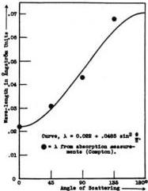
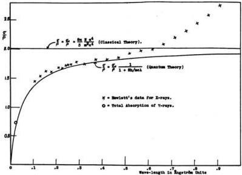

SCATTERING OF X-RAYS BY LIGHT ELEMENTS

497

is scattered backward. If for the hard γ-rays from radium C, α = 1.09, corresponding to λ = 0.022 A, we thus obtain β_max = 0.82. The effective velocity of the scattering electrons is, therefore (Eq. 8), β̄ = 0.52. These results are in accord with the fact that the average velocity of the

Fig. 5. The wave-length of scattered γ-rays at different angles with the primary beam, showing an increase at large angles similar to a Doppler effect.

β-rays excited by the γ-rays from radium is somewhat greater than half that of light.¹

Absorption of X-rays due to scattering.—Valuable information concerning the magnitude of the scattering is given by the measurements of the absorption of X-rays due to scattering. Over a wide range of wavelengths, the formula for the total mass absorption, μ/ρ = κλ² + σ/ρ, is found to hold, where μ is the linear absorption coefficient, ρ is the density, κ is a constant, and σ is the energy loss due to the scattering process. Usually the term κλ², which represents the fluorescent absorption, is the more important; but when light elements and short wavelengths are employed, the scattering process accounts for nearly all the energy loss. In this case, the constant κ can be determined by measurements on the longer wave-lengths, and the value of σ/ρ can then be estimated with considerable accuracy for the shorter wave-lengths from the observed values of μ/ρ.

Hewlett has measured the total absorption coefficient for carbon over a wide range of wave-lengths.² From his data for the longer wave-

¹ E. Rutherford, Radioactive Substances and their Radiations, p. 273.

² C. W. Hewlett, Phys. Rev. 17, 284 (1921).

498

ARTHUR H. COMPTON

lengths I estimate the value of κ to be 0.912, if λ is expressed in A. On subtracting the corresponding values of κλ² from his observed values of μ/ρ, the values of σ/ρ represented by the crosses of Fig. 6 are obtained.

Fig. 6. The absorption in carbon due to scattering, for homogeneous X-rays.

The value of σ₀/ρ as calculated for carbon from Thomson's formula is shown by the horizontal line at σ/ρ = 0.201. The values of σ/ρ calculated from Eq. (28) are represented by the solid curve. The circle shows the experimental value of the total absorption of γ-rays by carbon, which on the present view is due wholly to the scattering process.

For wave-lengths less than 0.5 A, where the test is most significant, the agreement is perhaps within the experimental error. Experiments by Owen,¹ Crowther,² and Barkla and Ayers³ show that at about 0.5 A the "excess scattering" begins to be appreciable, increasing rapidly in importance at the longer wave-lengths.⁴ It is probably this effect which results in the increase of the scattering absorption above the theoretical value for the longer wave-lengths. Thus the experimental values of the absorption due to scattering seem to be in satisfactory accord with the present theory.

True absorption due to scattering has not been noticed in the case of

¹ E. A. Owen, Proc. Camb. Phil. Soc. 16, 165 (1911).

² J. A. Crowther, Proc. Roy. Soc. 86, 478 (1912).

³ Barkla and Ayers, Phil. Mag. 21, 275 (1911).

⁴ Cf. A. H. Compton, Washington University Studies, 8, 109 ff. (1921).