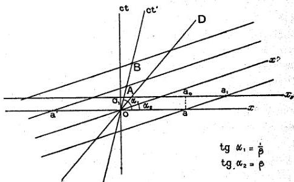

40

LOUIS DE BROGLIE

bien différent, nous retrouvons un résultat analogue, car la vitesse du mobile n'est pas autre chose que la vitesse du déplacement de l'énergie.

### III. — L'ONDE DE PHASE DANS L'ESPACE-TEMPS

Minkowski a montré le premier qu'on obtenait une représentation géométrique simple des relations de l'espace et du temps introduites par Einstein en considérant une multipli-

Fig. 1.

cité euclidienne à 4 dimensions dite Univers ou Espace-temps. Pour cela il prenait 3 axes de coordonnées rectangulaires d'espace et un quatrième axe normal aux 3 premiers sur lequel étaient portés les temps multipliés par $c\sqrt{-1}$. On porte plus volontiers aujourd'hui sur le quatrième axe la quantité réelle $ct$, mais alors les plans passant par cet axe et normaux à l'espace ont une géométrie pseudo euclidienne hyperbolique dont l'invariant fondamental est $c^2 dt^2 - dx^2 - dy^2 - dz^2$.

Considérons donc l'espace-temps rapporté aux 4 axes rectangulaires de l'observateur dit « fixe ». Nous prendrons pour axe des $x$ la trajectoire rectiligne du mobile et nous