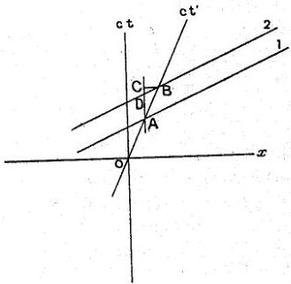

42

LOUIS DE BROGLIE

fixe avec une vitesse $\frac{c}{\beta}$. En effet, si la ligne $ox_i$ de la figure représente l'espace de l'observateur fixe au temps $t = 0$, on a $\overline{aa}_0 = c$. La phase qui pour $t = 0$, se trouvait en $a_i$, se trouve maintenant en $a_i$; pour l'observateur fixe, elle s'est donc déplacée dans son espace de la longueur $a_0a_i$ dans le sens $ox$ pendant l'unité de temps. On peut donc dire que sa vitesse est :

$$V = a_0a_i = aa_0 \cot(\widehat{xox'}) = \frac{c}{\beta}$$

$$\begin{array}{l} \text{tg } \widehat{CAB} = \beta \\ \text{tg } \widehat{CDB} = \frac{1}{\beta} \end{array}$$

Fig. 2.

L'ensemble des plans équiphases constitue ce que nous avons nommé l'onde de phase.

Reste à examiner la question des fréquences. Refaisons une petite figure simplifiée.

Les droites 1 et 2 représentent deux espaces équiphases successifs de l'observateur lié. $\overline{AB}$ est, avons-nous dit, égal à $c$ fois la période propre $T_0 = \frac{h}{m_0c^2}$.

AC projection de AB sur l'axe Ot est égal à

$$cT_1 = cT_0 \frac{1}{\sqrt{1 - \beta^2}}$$