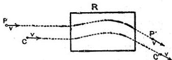

58

LOUIS DE BROGLIE

Ce résultat appelle plusieurs remarques. Au point de vue physique, il signifie que l'onde de phase de fréquence $\nu = \frac{W}{h}$ se propage dans le champ électrostatique avec une vitesse variable d'un point à l'autre suivant la valeur du potentiel. La vitesse $V$ dépend en effet de $\psi$ directement par le terme (généralement petit devant l'unité) $\frac{e\psi}{W - e\psi}$ et indirectement par $\beta$ qui se calcule en chaque point en fonction de $W$ et $\psi$.

Fig. 3.

De plus, on remarquera que $V$ est fonction de la masse et de la charge du mobile. Ce point peut paraître étrange, mais il l'est en réalité moins qu'il ne semble. Considérons un électron dont le centre $C$ se déplace avec la vitesse $v$; dans la conception classique, en un point $P$ dont les coordonnées dans un système lié à l'électron sont connues, se trouve une certaine énergie électromagnétique faisant en quelque sorte partie de l'électron. Supposons qu'après avoir traversé une région $R$ où règne un champ électromagnétique plus ou moins complexe, l'électron se trouve animé de la même vitesse $v$ mais autrement dirigée.

Le point $P$ du système lié à l'électron est venu en $P'$ et l'on peut dire que l'énergie primitivement en $P$ s'est transportée en $P'$. Le déplacement de cette énergie, même si l'on connaît les champs régnants dans $R$, ne peut être calculé que si la masse et la charge de l'électron sont données. Cette conclusion indiscutable pourrait un instant paraître bizarre parce que nous avons l'habitude invétérée de considérer la