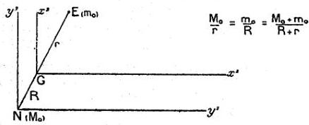

RECHERCHES SUR LA THÉORIE DES QUANTA

71

des déplacements simultanés du noyau. M. Bohr a pu traiter ce problème en s'appuyant sur le théorème suivant de Mécanique Rationnelle : « Si l'on rapporte le mouvement de l'électron à des axes de directions fixes liés au noyau, ce mouvement est le même que si ces axes étaient galiléens et si l'électron possédait une masse $\mu_0 = \frac{m_0 M_0}{m_0 + M_0}$ ».

Dans le système d'axes lié au noyau, le champ électrostatique agissant sur l'électron peut être considéré comme constant en tout point de l'espace et l'on est ainsi ramené au problème sans mouvement du noyau grâce à la substitu-

Fig. 4.

tion de la masse fictive $\mu_0$ à la masse réelle $m_0$. Au chapitre II du présent travail, nous avons établi un parallélisme général entre les grandeurs fondamentales de la Dynamique et celles de la théorie des Ondes; le théorème énoncé plus haut détermine donc quelles valeurs il faut attribuer à la fréquence de l'onde de phase électronique et à sa vitesse dans le système lié au noyau, système qui n'est pas galiléen. Grâce à cet artifice, les conditions quantiques de stabilité peuvent être considérées dans ce cas aussi comme pouvant s'interpréter par la résonance de l'onde de phase. Nous allons préciser en nous attachant au cas où noyau et électron décrivent des orbites circulaires autour de leur centre de gravité commun. Le plan de ces orbites sera pris comme plan des coordonnées d'indices 1 et 2 dans les deux systèmes. Les coordonnées d'espace dans le système galiléen