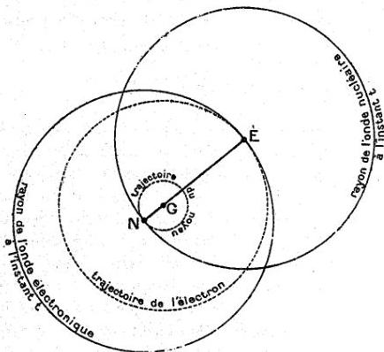

RECHERCHES SUR LA THÉORIE DES QUANTA

75

centre de gravité les rayons à l'instant $t$ des deux ondes de phase (trait plein) et les trajectoires décrites au cours du temps par les deux mobiles (trait pointillé). On parvient alors très bien à se représenter comment chaque mobile décrit sa trajectoire avec une vitesse qui à tout instant est tangente au rayon de l'onde de phase.

Fig. 5.

Insistons sur un dernier point. Les rayons de l'onde à l'instant $t$ sont les enveloppes de la vitesse de propagation, mais ces rayons ne sont pas les trajectoires de l'énergie, ils leur sont seulement tangents en chaque point. Ceci rappelle des conclusions connues de l'hydrodynamique où les lignes de courant, enveloppes des vitesses, ne sont les trajectoires des particules fluides que si leur forme est invariable, autrement dit si le mouvement est permanent.