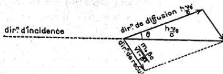

RECHERCHES SUR LA THÉORIE DES QUANTA

97

direction d'observation et d'autre part, qu'elle semble provoquer la mise en mouvement d'électrons. Presque simultanément et indépendamment l'un de l'autre, MM. P. Debye et A. H. Compton sont parvenus à donner de ces écarts par rapport aux lois classiques une interprétation fondée sur la notion de quantum de lumière.

En voici le principe : si un quantum de lumière est dévié de sa marche rectiligne en passant au voisinage d'un élec-

Fig. 6.

tron, nous devons supposer que durant le temps où les deux centres d'énergie sont suffisamment voisins, ils exercent l'un sur l'autre, une certaine action. Lorsque cette action prendra fin, l'électron d'abord au repos aura emprunté au corpuscule lumineux une certaine énergie ; d'après la relation du quantum, la fréquence diffusée sera donc moindre que la fréquence incidente. La conservation de la quantité de mouvement achève de déterminer le problème. Supposons que le quantum diffusé se déplace dans une direction faisant l'angle $\theta$ avec le prolongement de la direction d'incidence. Les fréquences avant et après la diffusion étant $\nu_0$ et $\nu_\theta$ et la masse propre de l'électron étant $m_0$, on aura :

$$h\nu_\theta = h\nu_0 - m_0c^2 \left( \frac{1}{\sqrt{1-\frac{\beta^2}{\nu}}} - 1 \right)$$
$$\left( \frac{m_0\beta c}{\sqrt{1-\frac{\beta^2}{\nu}}} \right)^2 = \left( \frac{h\nu_0}{c} \right)^2 + \left( \frac{h\nu_\theta}{c} \right)^2 - 2 \frac{h\nu_0}{c} \cdot \frac{h\nu_\theta}{c} \cos \theta$$

Cette seconde relation se lit de suite sur la figure ci-jointe.

La vitesse $v = \beta c$ est celle qu'acquiert l'électron par ce processus.

Ann. de Phys., 10e série, t. III (Janvier-Février 1925)

7