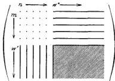

Zur Quantenmechanik. II.

595

daß jeder Zustand das statistische Gewicht 1 haben soll. Dem entspricht es, daß wir eine Normierung der $x_{kn}$ auf Grund der Forderung

$$\sum_k x_{kn} x_{kn}^* = 1$$

durchführten. Im Falle kontinuierlicher Zustandsmannigfaltigkeiten war eine so einfache Festlegung der a priori-Wahrscheinlichkeiten nicht möglich, zu ihrer Bestimmung und damit auch zur Bestimmung der Funktion $\varphi$ sind eingehendere Untersuchungen des betreffenden Problems notwendig. Daher dürfte sich auch der Zusammenhang der Übergangswahrscheinlichkeiten mit den Amplituden im Falle kontinuierlicher Spektra etwas verwickelter gestalten, als bei den Linienspektra.

Die durch (40), Kap. 3, und entsprechende Formen dargestellten Matrizen von $\pmb{p}, \pmb{q}$ oder $f(\pmb{p}, \pmb{q})$ lassen sich allgemein durch nebenstehendes Schema anschaulich machen: Die physikalische Bedeutung dieses Schemas leuchtet ein.

Es gibt vier Arten von „Übergängen“, die etwa ein einfaches Analogon bilden zu den in der bisherigen Theorie des Wasserstoffatoms postulierten „Übergängen“: 1. von Ellipse zu Ellipse, 2. von Ellipse

zu Hyperbel, 3. von Hyperbel zu Ellipse, 4. von Hyperbel zu Hyperbel.

Gegen die Formeln (38) und (40), Kap. 3, kann noch eingewendet werden, daß die unendlichen Summen der rechten Seite sicher in manchen Fällen nicht konvergieren, also auch keine Funktion darstellen, da ja auch in der klassischen Theorie eine Darstellung einer Funktion $f(\pmb{p}, \pmb{q})$ durch Fourierintegrale manchmal nicht möglich ist, z. B. dann nicht, wenn die betreffenden Funktionen $f$ für große Zeiten linear mit der Zeit anwachsen (was im allgemeinen für die Koordinate der Fall sein wird). Auf diesen Einwand kann man aber erwidern, daß die beobachtbaren Wirkungen des Atoms (wie die Strahlung, die Kraft auf ein anderes Atom usw.) im allgemeinen nicht zu dieser Art von Funktionen gehören, daß also die ihnen entsprechenden Summen vom Typus der Formeln (40), Kap. 3, konvergieren dürften.

#### Kapitel 4. Physikalische Anwendungen der Theorie.

§ 1. Sätze über Impuls und Drehimpuls; Intensitätsformeln und Auswahlregeln. Als Anwendung der allgemeinen Theorie, wie sie im vorangehenden begründet wurde, sollen nun die bekannten Tatsachen bezüglich der „Quantelung“ des Drehimpulses und einige damit zusammenhängende Gesetzmäßigkeiten abgeleitet werden.

