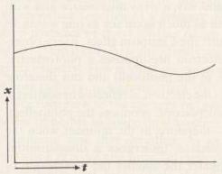
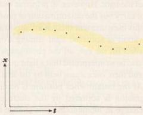

I.3 PRINCIPLE OF INDETERMINISM

63

seems to follow directly from the basic equations of quantum mechanics. When a definite mass m is given, in our everyday physics it is perfectly understandable to speak of the position and the velocity of the center of gravity of this mass. In quantum mechanics, however, the relation pq - qp = -iħ between mass, position, and velocity is believed to hold. Therefore we have good reason to become suspicious every time uncritical use is made of the words “position” and “velocity.” When one admits that discontinuities are somehow typical of processes that take place in small regions and in short times, then a contradiction between the concepts of “position” and “velocity” is quite plausible. If one considers, for example, the motion of a particle in one dimension, then in continuum theory one will be able to draw (Fig. 1) a worldline x(t) for the track of the particle (more precisely, its center of gravity), the tangent of which gives the velocity at every instant. In contrast, in a theory based on discontinuity there might be in place of this curve a series of points at finite separation (Fig. 2). In this case it is clearly meaningless to speak about one velocity at one position (1) because one velocity can only be defined by two positions and (2), conversely, because any one point is associated with two velocities.

FIGURE 1

FIGURE 2

The question therefore arises whether, through a more precise analysis of these kinematic and mechanical concepts, it might be possible to clear up the contradictions evident up to now in the physical interpretations of quantum mechanics and to arrive at a physical understanding of the quantum-mechanical formulas.*

* The present work has arisen from efforts and desires to which other investigators have already given clear expression, before the development of quantum mechanics. I call attention here especially to Bohr’s papers on the basic postulates of quantum theory (for example, Zeits. f. Physik, 13, 117 [1923]) and Einstein’s discussions on the connection between wave field and light quanta. The problems dealt with here are discussed most clearly in recent times, and the problems arising are partly answered, by W. Pauli (“Quantentheorie,” Handbuch der Physik, Vol. XXIII, cited hereafter as l.c.); quantum mechanics has changed only slightly the formulation of these problems as given by Pauli. It is also a special pleasure to thank here Herrn Pauli for the repeated stimulus I have received from our oral and written discussions, which have contributed decisively to the present work.

umph
brea
won
not
but
brea
rea
an
ero
m

1909

the
old
test