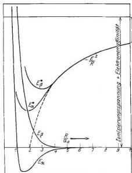

Wechselwirkung neutraler Atome und homöopolare Bindung.

469

Kerne sich befinden (analog den Störungen im He-Atom!). Wir erhalten für getrennte Ionen statt der $2 E_0$ ($-27$ Volt) der neutralen Atome eine um die Ionisierungsarbeit (13,5 Volt) höhere Energie (korrigiert um den Betrag der Elektronenaffinität, der aber nur sehr geringfügig ist. Als Eigenfunktionen sind dementsprechend sogleich statt (21) He-artig gestörte Funktionen zu benutzen:

$$\psi_{12} \text{ bzw. } \varphi_{12},$$

welche jedenfalls in 1 und 2 symmetrisch sind und sich nur der Lage im $q$-Raum, nicht der Gestalt nach unterscheiden.

Berücksichtigen wir jetzt die Störung des He-artigen Ions H$^-$ durch das H$^+$, so erhalten wir wegen des Symmetriecharakters der Wellengleichung (1) in üblicher Weise als Eigenfunktionen nullter Ordnung (ohne Normierung):

$$\left. \begin{aligned} \alpha^* &= \psi_{12} + \varphi_{12}, \\ \beta^* &= \psi_{12} - \varphi_{12}. \end{aligned} \right\} \quad (22)$$

Bei gegenseitiger Annäherung der beiden Ionen werden die zugehörigen Eigenwerte $E_\alpha^*$ und $E_\beta^*$ zunächst abnehmen, ungefähr wie das Ionenpotential $-\frac{\varepsilon^2}{R}$ (Fig. 2).

Hierbei wird $E_\alpha^*$, als zum knotenlosen $\alpha^*$ gehörig, stets tiefer als $E_\beta^*$ sein. Der Unterschied $E_\beta^* - E_\alpha^*$ ist proportional der Frequenz des Austauschs der Ionenladungen.

Solange die Eigenwerte $E_\alpha^*$ und $E_\beta^*$ nicht in die Nähe unserer Energiekurven von § 2 (sie sind

in Fig. 2 noch einmal eingezeichnet$^1$) kommen, sind die Rechnungen des § 1 als Störungen des Eigenwertes $2 E_0 = -27$ Volt aufzufassen und nicht zu beanstanden. Etwas Neues tritt aber ein, wenn die neuen Kurven den alten sehr nahe kommen. Für diese Werte von $R$ wird der

Fig. 2. Ionenpotential ($E_\alpha^*, E_\beta^*$), verglichen mit dem Potential neutraler Atome ($E_\alpha, E_\beta$).

$^1$ Auf Grund der nachfolgenden Überlegungen ziehen wir die hier angegebene Zuordnung der Terme der von F. Hund, i. e., Fig. 12, vorgeschlagenen vor, denn aus den Überlegungen des § 4 geht hervor, daß durchaus nicht alle Zustände des 2-H-Problems in Zustände der H$_2$-Molekel, geschweige des He übergehen.