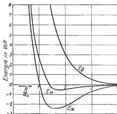

462

W. Heitler und F. London,

Den Verlauf zeigt die mittlere Kurve in Fig. 1. $R$ ist in Einheiten von $a_0 = 0,532$ Å, die Energie in Volt aufgetragen.

Der übrige Teil der Energien (11) läßt sich nicht so einfach deuten. Die dort vorkommenden Integrale ließen sich nicht alle auswerten. Man berechnet:

$$\left. \begin{aligned} S &= \left( 1 + \frac{R}{a_0} + \frac{R^2}{3 a_0^2} \right)^2 e^{-\frac{2R}{a_0}} \\ \int \frac{\psi_1 \psi_2 \varphi_1 \varphi_2}{2} \left( \frac{\varepsilon^2}{r_{a_1}} + \frac{\varepsilon^2}{r_{a_2}} + \frac{\varepsilon^2}{r_{b_1}} + \frac{\varepsilon^2}{r_{b_2}} - \frac{2 \varepsilon^2}{R} \right) d\tau_1 d\tau_2 \\ &= \frac{2 \varepsilon^2}{a_0} \left( 1 + \frac{2R}{a_0} + \frac{4}{3} \frac{R^2}{a_0^2} + \frac{R^2}{3 a_0^2} \right) e^{-\frac{2R}{a_0}} - \frac{\varepsilon^2}{R} S, \end{aligned} \right\} \quad (14)$$

während wir für das fehlende Integral über $1/r_{12}$ nur eine obere Grenze erhielten$^1$. Es ist

$$\int \frac{\psi_1 \psi_2 \varphi_1 \varphi_2}{r_{12}} d\tau_1 d\tau_2 < \frac{\varepsilon^2}{a_0} \frac{5}{8} \left( 1 + \frac{R}{a_0} + \frac{R^2}{3 a_0^2} \right)^2 e^{-\frac{2R}{a_0}}. \quad (15)$$

Mit dieser oberen Grenze ergeben sich die Kurven $E_\alpha$ und $E_\beta$ in Fig. 1.

$E_\beta$ zeigt beständig Abstoßung; $E_\alpha$ zeigt in großer Entfernung Anziehung, dann ein Minimum ungefähr bei $R = \frac{3}{2} a_0$ und in kleiner Entfernung Abstoßung. Die hier auftretende nichtpolare Anziehung zeigt

Fig. 1. Potential zweier neutraler H-Atome.
($E_\alpha$ = homöopolare Anziehung.
$E_\beta$ = elastische Reflexion.)

sich als charakteristisch quantenmechanischer Effekt. Sie kommt bereits zustande ohne Berücksichtigung der Störungen durch Polarisation. Es ist auch bemerkenswert, daß die Abstoßung $E_\beta$, wie man sieht, zum größten Teil ebenfalls auf diesem quantenmechanischen Effekt, nicht auf der Coulombschen Wechselwirkung ($E_{11}$) beruht.

Die physikalische Bedeutung der beiden Lösungen, behaupten wir, ist folgende: Die antisymmetrische Lösung mit der Wechsel-

wirkungsenergie $E_\beta$ entspricht der van der Waalsschen Abstoßung (elastische Reflexion) der beiden Wasserstoffatome. Ist aber $\alpha$ angeregt,

$^1$ Es handelt sich dabei um die Bestimmung des Selbstpotentials einer Ladungsverteilung auf konfokalen Ellipsoiden, welche viel komplizierter ist, als