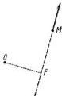

810

SCHRÖDINGER: Die gegenwärtige Situation in der Quantenmechanik.

Die Natur-
wissenschaften

Natur zuläßt. Wie sieht die Sache nun aber wirklich aus? In wichtigen und typischen Fällen folgendermaßen.

Wenn man die Energie eines PLANCKSchen Oszillators mißt, dann ist die Wahrscheinlichkeit, dafür einen Wert zwischen $E$ und $E'$ zu finden, nur dann möglicherweise von Null verschieden, wenn zwischen $E$ und $E'$ ein Wert aus der Reihe

$$3\pi h\nu, 5\pi h\nu, 7\pi h\nu, 9\pi h\nu, \dots \dots$$

liegt. Für jedes Intervall, das keinen dieser Werte enthält, ist die Wahrscheinlichkeit Null. Auf deutsch: andere Meßwerte sind ausgeschlossen. Die Zahlen sind ungerade Multipla der Modellkonstante $\pi h\nu$ ($h =$ PLANCKSche Zahl, $\nu =$ Frequenz des Oszillators). Zwei Dinge fallen auf. Erstens fehlt die Bezugnahme auf vorangehende Messungen — die sind gar nicht nötig. Zweitens: die Aussage leidet wirklich nicht an einem übertriebenen Mangel an Präzision, ganz im Gegenteil, sie ist schärfer als eine wirkliche Messung je sein kann.

Ein anderes typisches Beispiel ist der Betrag des Impulsmoments. In Fig. 1 sei $M$ ein bewegter Massenpunkt, der Pfeil soll seinen Impuls (Masse mal Geschwindigkeit) nach Größe und Richtung darstellen. $O$ ist irgendein fester Punkt im Raum, sagen wir der Koordinatenursprung; also nicht ein Punkt mit physikalischer Bedeutung, sondern ein geometrischer Bezugspunkt. Als Betrag des Impulsmoments von $M$ bezüglich $O$ bezeichnet die klassische Mechanik das Produkt aus der Länge des Impulspfeiles und der Länge des Lotes $OF$.

Fig. 1. Impulsmoment:

$M$ ist ein materieller Punkt, $O$ ein geometrischer Bezugspunkt. Der Pfeil soll den Impuls (= Masse mal Geschwindigkeit) von $M$ darstellen. Dann ist das Impulsmoment das Produkt aus der Länge des Pfeils und der Länge $OF$.

In der Q.M. gilt für den Betrag des Impulsmoments ganz Ähnliches wie für die Energie des Oszillators. Wieder ist die Wahrscheinlichkeit Null für jedes Intervall, das keinen Wert aus der folgenden Reihe enthält

$$O, h\sqrt{2}, h\sqrt{2 \times 3}, h\sqrt{3 \times 4}, h\sqrt{4 \times 5}, \dots \dots$$

d. h. nur einer dieser Werte kann herauskommen. Das gilt wieder ganz ohne Bezug auf vorangehende Messungen. Und man kann sich wohl vorstellen, wie wichtig diese präzise Aussage ist, viel wichtiger als die Kenntnis, welcher von diesen Werten oder welche Wahrscheinlichkeit für jeden von ihnen im Einzelfall wirklich vorliegt. Außerdem fällt hier aber noch auf, daß vom Bezugspunkt gar nicht die Rede ist: wie immer man ihn wählt, man wird einen Wert aus dieser Reihe finden. Am Modell ist diese Behauptung unsinnig, denn das Lot $OF$ verändert sich stetig, wenn man den Punkt $O$ ver-

schiebt, und der Impulspfeil bleibt ungeändert. Wir sehen an diesem Beispiel, wie die Q.M. das Modell zwar benützt, um an ihm die Größen abzulesen, welche man messen kann und über welche Voraussagen zu machen für sinnvoll gehalten wird, während es für unzuständig erklärt werden muß, den Zusammenhang dieser Größen untereinander zum Ausdruck zu bringen.

Hat man nun nicht in beiden Fällen das Gefühl, daß der wesentliche Inhalt dessen, was gesagt werden soll, sich nur mit einiger Mühe zwängen läßt in die spanischen Stiefel einer Voraussage über die Wahrscheinlichkeit, für eine Variable des klassischen Modells diesen oder jenen Meßwert anzutreffen? Hat man nicht den Eindruck, daß hier von grundlegenden Eigenschaften neuer Merkmalgruppen die Rede ist, die mit den klassischen nur noch den Namen gemein haben? Es handelt sich keineswegs um Ausnahmefälle, gerade die wahrhaft wertvollen Aussagen der neuen Theorie haben diesen Charakter. Es gibt wohl auch Aufgaben, die sich dem Typus nähern, auf den die Ausdrucksweise eigentlich zugeschnitten ist. Aber sie haben nicht annähernd dieselbe Wichtigkeit. Und vollends die, die man sich naiverweise als Schulbeispiele konstruieren würde, die haben gar keine. „Gegeben der Ort des Elektrons im Wasserstoffatom zur Zeit $t = 0$; man konstruiere seine Ortsstatistik zu einer späteren Zeit.“ Das interessiert keinen Menschen.

Dem Wortlaut nach beziehen sich alle Aussagen auf das anschauliche Modell. Aber die wertvollen Aussagen sind an ihm wenig anschaulich und seine anschaulichen Merkmale sind von geringem Wert.

# § 4. Kann man der Theorie ideale Gesamtheiten unterlegen?

Das klassische Modell spielt in der Q.M. eine Proteus-Rolle. Jedes seiner Bestimmungsstücke kann unter Umständen Gegenstand des Interesses werden und eine gewisse Realität erlangen. Aber niemals alle zugleich — bald sind es diese, bald sind es jene, und zwar immer höchstens die Hälfte eines vollständigen Variablensatzes, der ein klares Bild von dem augenblicklichen Zustand erlauben würde. Wie steht es jeweils mit den übrigen? Haben die dann keine Realität, vielleicht (s. v. v.) eine verschwommene Realität; oder haben stets alle eine und ist bloß, nach Satz A von § 2 ihre gleichzeitige Kenntnis unmöglich?

Die zweite Auffassung ist außerordentlich naheliegend für den, der die Bedeutung der statistischen Betrachtungsweise kennt, die in der zweiten Hälfte des vorigen Jahrhunderts entstanden ist; zumal wenn er gedenkt, daß am Vorabend des neuen aus ihr, aus einem zentralen Problem der statistischen Wärmelehre, die Quantentheorie geboren wurde (Max PLANCKS Theorie der Wärmestrahlung, Dezember 1899). Das Wesen jener Denkrichtung besteht gerade darin, daß man praktisch niemals alle Bestimmungsstücke des