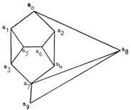

68

S. KOCHEN & E. P. SPECKER

induces a map $h^* : T \to \{0, 1\}$ from a subset $T$ of the unit sphere $S$ into $\{0, 1\}$ such that for any three mutually orthogonal points in $T$ exactly one is mapped by $h^*$ into 1.

It will be convenient in what follows to represent points on $S$ by the vertices of a graph. Two vertices which are joined by an edge in the graph represent orthogonal points on $S$. When we say that a graph $\Gamma$ is realizable on $S$ we mean that there is an assignment of points of $S$ to the vertices of $\Gamma$, distinct points for distinct vertices, with the orthogonality relations as indicated in $\Gamma$.

Lemma 1. The following graph $\Gamma_1$ is realizable on $S$.

In fact, if $p$ and $q$ are points on $S$ such that $0 \leq \sin \theta \leq \frac{1}{2}$ where $\theta$ is the angle subtended by $p$ and $q$ at the center of $S$, then there exists a map $u : \Gamma_1 \to S$ such that $u(a_0) = p$ and $u(a_q) = q$.

Proof. Since $u(a_8)$ is orthogonal to $u(a_0) \cup u(a_9)$ and $u(a_7)$ is orthogonal to $u(a_8)$, $u(a_7)$ lies in the plane $u(a_0) \cup u(a_9)$. Also since $u(a_7)$ is orthogonal to $u(a_8)$, we have that $\varphi = \pi/2 - \theta$, where $\varphi$ is the angle subtended at the center of $S$ by $u(a_0)$ and $u(a_7)$. Let $u(a_3) = \bar{\imath}$ and $u(a_8) = \bar{k}$. Then we may take

$$u(a_1) = (\bar{j} + x\bar{k})(1 + x^2)^{-1/2} \quad \text{and} \quad u(a_2) = (\bar{\imath} + y\bar{j})(1 + y^2)^{-1/2}.$$

The orthogonality conditions then force

$$u(a_3) = (x\bar{j} - \bar{k})(1 + x^2)^{-1/2},$$

$$u(a_4) = (y\bar{\imath} - \bar{j})(1 + y^2)^{-1/2},$$

and hence,

$$u(a_0) = (xy\bar{\imath} - x\bar{j} + \bar{k})(1 + x^2 + x^2y^2)^{-1/2},$$

$$u(a_7) = (\bar{\imath} + y\bar{j} + xy\bar{k})(1 + y^2 + x^2y^2)^{-1/2}.$$

Thus

$$\cos \varphi = \frac{xy}{((1 + x^2 + x^2y^2)(1 + y^2 + x^2y^2))^{1/2}}.$$

By elementary calculus the maximum value of this expression is $\frac{1}{2}$. Hence $\Gamma_1$ is realizable if $0 \leq \cos \varphi \leq \frac{1}{2}$, i.e., $0 \leq \sin \theta \leq \frac{1}{2}$.

Lemma 2. The following graph $\Gamma_2$ is realizable on $S$.

This content downloaded from 140.0.246.18 on Thu, 30 Sep 2021 02:54:11 UTC All use subject to https://about.jstor.org/terms