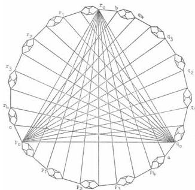

QUANTUM MECHANICS

69

The graph $\Gamma_2$ is obtained from the above diagram by identifying the points $p_0$ and $a$, $q_0$ and $b$, and $r_0$ and $c$. The vertices of $\Gamma_2$ are the points on the rim of this diagram.

Proof. For $0 \leq k \leq 4$, let

$$P_k = \cos \frac{\pi k}{10} \bar{i} + \sin \frac{\pi k}{10} \bar{j},$$

$$Q_k = \cos \frac{\pi k}{10} \bar{j} + \sin \frac{\pi k}{10} \bar{k},$$

$$R_k = \sin \frac{\pi k}{10} \bar{i} + \cos \frac{\pi k}{10} \bar{k}.$$

Let $u(p_k) = P_k$, $u(q_k) = Q_k$, $u(r_k) = R_k$, for $0 \leq k \leq 4$. Since the subgraph of $\Gamma_2$ contained between the points $p_0$, $p_1$, and $r_0$ is a copy of $\Gamma_1$ and the angle subtended by $P_0$, $P_1$ is $\pi/10$ ($\sin \pi/10 < \frac{1}{3}$), we may extend $u$ to a realization of this subgraph on $S$. A realization of the subgraph of $\Gamma_2$ contained between the points $p_1$, $p_2$, and $r_0$ is then obtained by rotating $P_0$ to $P_1$ about $R_0$. The remainder of the realization $u$ is obtained by similar rotations about $R_0$, $P_0$, and $Q_0$.

Let $T$ be the image of $\Gamma_2$ under $u$, consisting of 117 points on $S$. Let $D$ be the partial Boolean subalgebra generated by $T$ in $\mathbf{B}(E^3)$. (This corresponds to completing the graph $\Gamma_2$ so that every edge lies in a triangle. In the resulting graph the points and edges correspond to one and two dimensional linear subspaces of $\mathbf{B}(E^3)$ respectively.)

This content downloaded from
140.0.246.18 on Thu, 30 Sep 2021 02:54:11 UTC
All use subject to https://about.jstor.org/terms