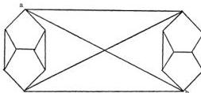

70

S. KOCHEN & E. P. SPECKER

**Theorem 1.** *The finite partial Boolean algebra D has no homomorphism onto $Z_2$.*

**Proof.** As we have seen, such a homomorphism $h : D \to Z_2$ induces a map $h^* : T \to \{0, 1\}$ satisfying condition (6). Reverting to the graph $\Gamma_2$, we shall assume that there is a map $k : \Gamma_2 \to \{0, 1\}$ satisfying condition (6). Let us consider the action of $k$ on a copy in $\Gamma_2$ of the graph $\Gamma_1$. Suppose that $k(a_0) = 1$, then it follows that $k(a_9) = 1$. For if $k(a_9) = 0$, then since $k(a_8) = 0$ we must have $k(a_7) = 1$. Hence, $k(a_1) = k(a_2) = k(a_3) = k(a_4) = 0$; so that $k(a_3) = k(a_6) = 1$, a contradiction.

Now since $p_0$, $q_0$, and $r_0$ lie in a triangle in $\Gamma_2$, exactly one of these points is mapped by $k$ onto 1, say $k(p_0) = 1$. Hence, by the above argument $k(p_1) = 1$. Continuing in this manner in $\Gamma_2$ we find $k(p_2) = k(p_3) = k(p_4) = k(q_0) = 1$. But $k(q_0) = 1$ contradicts the condition that $k(p_0) = 1$, and proves the theorem.

**Remark.** Theorem 1 implies that there is no map of the sphere $S$ onto $\{0, 1\}$ satisfying condition (4), and hence no homomorphism from $\mathbf{B}(E^3)$ onto $Z_2$. This result, first stated in Specker [17], can be obtained more simply either by a direct topological argument or by applying a theorem of Gleason [6]. However, it seems to us important in the demonstration of the non-existence of hidden variables that we deal with a small finite partial Boolean algebra. For otherwise a reasonable objection can be raised that in fact it is not physically meaningful to assume that there are a continuum number of quantum mechanical propositions.

To obtain a partial Boolean subalgebra of $\mathbf{B}(E^3)$ which is not imbeddable in a Boolean algebra a far smaller graph than $\Gamma_2$ suffices. The following graph $\Gamma_3$ may be shown to be realizable on $S$ in similar fashion to the proof of Lemma 2.

Let $F$ be the partial Boolean algebra generated by the set of 17 points on $S$ corresponding to $\Gamma_3$. If $h : F \to Z_2$ is a homomorphism then as we have seen in the proof of Theorem 1, if $h(a) = 1$ then $h(b) = 1$; by symmetry also $h(b) = 1$ implies $h(a) = 1$. That is, $h(a) = h(b)$ in every homomorphism $h : F \to Z_2$. If $\varphi : F \to B$ is an imbedding of $F$ into a Boolean algebra, then by the semi-simplicity of $B$ there exists a homomorphism $h' : B \to Z_2$ such that $h'(\varphi(a)) \neq h'(\varphi(b))$. Hence, $h = h'\varphi$ is a homomorphism from $F$ onto $Z_2$ such that $h(a) \neq h(b)$, a contradiction.

This content downloaded from
140.0.246.18 on Thu, 30 Sep 2021 02:54:11 UTC
All use subject to https://about.jstor.org/terms