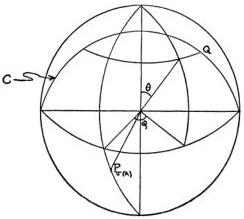

78

S. KOCHEN & E. P. SPECKER

$$\eta = \begin{bmatrix} \cos (\rho/2) \\ \sin (\rho/2) \end{bmatrix}.$$

Since $A$ was assumed to be a projection matrix, $\eta$ is also the eigenvector of $A$ belonging to the eigenvalue $+1$. Thus,

$$\begin{aligned} \langle A\psi, \psi \rangle &= \langle\langle\psi, \eta\rangle\eta, \psi\rangle \\ &= |\langle\psi, \eta\rangle|^2 \\ &= \cos^2 (\rho/2). \end{aligned}$$

Our problem is thus reduced to solving for $u(\theta)$ the integral equation

$$\cos^2 (\rho/2) = \int_{S^*} f_A(p)u(\theta) \, dp.$$

Since

$$f_A(p) = \begin{cases} 1 & \text{on } S_{P_{\epsilon(A)}}^+ \\ 0 & \text{otherwise} \end{cases}$$

this equation becomes

$$\cos^2 (\rho/2) = \int_T u(\theta) \, dp$$

where $T = S_{P_{\epsilon(A)}}^+ \cap S_{P_\theta}^+$. Thus,

$$\cos^2 (\rho/2) = \int_{\rho-\pi/2}^{\pi/2} \int_{-\varphi_\theta}^{\varphi_\theta} u(\theta) \sin \theta \, d\varphi \, d\theta$$

where $\varphi_\theta$ is the azimuthal angle of the point $Q = (\sin \theta \cos \varphi_\theta, \sin \theta \sin \varphi_\theta, \cos \theta)$ with polar angle $\theta$ which lies on the great circle $C$ perpendicular to the point $P_{\epsilon(A)} = (\sin \rho, 0, \cos \rho)$.

This content downloaded from 140.0.246.18 on Thu, 30 Sep 2021 02:54:11 UTC All use subject to https://about.jstor.org/terms