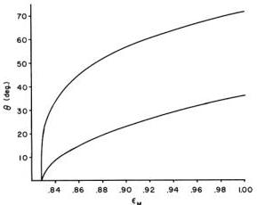

VOLUME 23, NUMBER 15

PHYSICAL REVIEW LETTERS

13 OCTOBER 1969

and

$$G _ { 1 } ( \vartheta ) = \frac { 1 } { 4 } ( \frac { 4 } { 7 } - \cos \vartheta + \sin ^ { 2 } \vartheta - \frac { 1 } { 3 } \cos ^ { 3 } \vartheta ) , \quad G _ { 2 } ( \vartheta ) = \frac { 2 } { 3 } - \frac { 1 } { 3 } ( \sin ^ { 2 } \vartheta + 2 ) \cos \vartheta , \quad G _ { 3 } ( \vartheta ) = \frac { 4 } { 3 } - \cos \vartheta - \frac { 1 } { 3 } \cos ^ { 3 } \vartheta .$$

The predictions for a 0-1-1 electric-dipole cascade (and for a 1-1-0, provided the initial statistical state of the atom is isotropic) are obtained from (3) upon replacing $F _ { 1 } ( \vartheta )$ with $- F _ { 2 } ( \vartheta )$ where

$$F _ { 2 } ( \vartheta ) = 2 G _ { 1 } ^ { 2 } ( \vartheta ) [ 2 G _ { 2 } ( \vartheta ) G _ { 3 } ( \vartheta ) + \frac { 1 } { 2 } G _ { 3 } ^ { 2 } ( \vartheta ) ] ^ { - 1 } .$$

For sufficiently efficient polarizers one easily sees that there exist sets of relative orientations for which the quantum mechanical counting rates violate Inequality (2b). The greatest violation always occurs at $\alpha = 2 2 . 5 ^ { \circ }$ , $\beta = 4 5 ^ { \circ }$ , and $\gamma = 1 5 7 . 5 ^ { \circ }$ for the 0-1-0 cascade and at $\alpha = 6 7 . 5 ^ { \circ }$ , $\beta = 1 3 5 ^ { \circ }$ , and $\gamma = 1 1 2 . 5 ^ { \circ }$ for the 0-1-1 cascade. Note that in each case the four angles $\alpha$ , $\alpha + \beta$ , $\gamma$ , and $\beta + \gamma$ which occur in Inequality (2b) characterize only two distinct relative orientations of the polarizers, namely $2 2 . 5 ^ { \circ }$ and $6 7 . 5 ^ { \circ }$ .

In an actual experiment $F _ { j } ( \theta )$ is less than 1, because of finite half-angle $\theta$ , and $\epsilon _ { M }$ is never unity. Assuming the use of calcite polarizers (for which $\epsilon _ { m } \approx 1 0 ^ { - 3 }$ ), taking $\epsilon _ { M } ^ { 1 } \approx \epsilon _ { M } ^ { 3 } \approx \epsilon _ { M }$ for simplicity, and using the above choices for $\alpha$ , $\beta$ , and $\gamma$ , we find that for either type of cascade, the condition for violation of Inequality (2b) is

$$\sqrt { 2 } F _ { j } ( \theta ) + 1 > 2 / \epsilon _ { M } . \tag { 4 }$$

This is the essential requirement on the design of a decisive experiment. For given $F _ { j } ( \theta )$ , (4)

FIG. 1. Upper limits on detector half-angle $\theta$ as a function of polarizer efficiency $\epsilon _ { M }$ . To test for hidden-variable theories, the experiment must be performed in the region below the appropriate curve—the upper curve for a 0-1-0 cascade, the lower for a 0-1-1.

implies a lower limit on $\epsilon _ { M }$ , and vice versa. Since both $F _ { 1 } ( \vartheta )$ and $F _ { 2 } ( \vartheta )$ are monotonically decreasing functions, a lower limit on $F _ { j } ( \vartheta )$ implies an upper limit on $\vartheta$ . Condition (4) and numerical evaluation of $F _ { 1 } ( \vartheta )$ and $F _ { 2 } ( \vartheta )$ lead to the curves shown in Fig. 1, from which one can directly read combinations of $\vartheta$ and $\epsilon _ { M }$ suitable for a decisive experiment. The experiment can be performed with uncoated calcite polarizers ($\epsilon _ { M } \approx 0 . 9 2$ ); however, if the polarizers have antireflection coatings ($\epsilon _ { M } \approx 0 . 9 5$ ), a larger $\vartheta$ and hence a larger counting rate can be achieved.

The authors gratefully acknowledge helpful discussions with Y. Aharonov, M. Jammer, L. Kasday, D. Nartonis, C. Papaliolios, F. Pipkin, D. Pritchard, J. L. Snider, H. Stein, and C. R. Willis.

*This paper is an expansion of ideas presented by one of us (J.F.C.) at the Spring 1969 meeting of the American Physical Society [Bull. Am. Phys. Soc. 14, 578 (1969)]. The same conclusions had been reached independently by two of us (A.S. and M.A.H.).

†Present address: Department of Physics, University of California, Berkeley, Calif.

¹A. Einstein, B. Podolsky, and N. Rosen, Phys. Rev. 47, 777 (1935).

²N. Bohr, Phys. Rev. 48, 696 (1935).

³For an excellent survey of these proofs see J. S. Bell, Rev. Mod. Phys. 38, 447 (1966).

⁴J. S. Bell, Physics 1, 195 (1965).

⁵D. Bohm, Quantum Theory (Prentice-Hall, Inc., Englewood Cliffs, New Jersey, 1951), p. 614.

⁶Albert Einstein: Philosopher-Scientist, edited by P. Schilpp (Library of Living Philosophers, Evanston, Ill., 1949), pp. 681-682.

⁷C. S. Wu and I. Shaknov, Phys. Rev. 77, 136 (1950); C. A. Kocher and E. D. Commins, Phys. Rev. Letters 18, 575 (1967). See also C. A. Kocher, thesis, University of California, 1967, University of California Radiation Laboratory Report No. UCRL-17587 (unpublished).

⁸It may appear that the assumption can be established experimentally by measuring detection rates when a controlled flux of photons of known polarization impinges on each detector. From the standpoint of hidden-variable theories, however, these measurements are irrelevant, since the distribution of the hidden variables when the fluxes are thus controlled is almost certain to be different from the $\rho ( \lambda )$ governing our ensemble. In view of the difficulty of an experimental check, the assumption could be challenged by an advocate of hidden-variable theories in case the outcome of the proposed experiment favors quantum mechanics. However, highly pathological detectors are required to con-

883