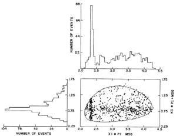

VOLUME 23, NUMBER 15

PHYSICAL REVIEW LETTERS

13 OCTOBER 1969

vert hidden-variable emergence rates into quantum mechanical counting rates.

\( ^{9} \) It has been shown by D. Bohm and Y. Aharonov, Phys. Rev. 108, 1070 (1957), that the WS experiment is a decisive refutation of a hypothesis studied by W. H.

Furry, Phys. Rev. 49, 393, 476 (1936).

\( ^{10} \) For details see M. A. Horne, thesis, Boston University, 1969 (unpublished).

\( ^{11} \) The distribution is given in H. S. Snyder, S. Pasternack, and J. Hornbostel, Phys. Rev. 73, 440 (1948).

\[
\Xi \text {   RESONANCES   IN   } K ^ {-} p \rightarrow \Xi \pi K \text {   AT   } 2. 8 7 \mathrm{GeV} / c ^ {*}
\]

S. Apsell, N. Barash-Schmidt, L. Kirsch, and P. Schmidt
Department of Physics, Brandeis University, Waltham, Massachusetts 02154

and

C. Y. Chang, R. J. Hemingway, B. V. Khoury, A. R. Stottlemyer, H. Whiteside,† and G. B. Yodh
Department of Physics and Astronomy, University of Maryland, College Park, Maryland 20742

and

M. Goldberg, K. Jaeger, C. McCarthy, B. Meadows, and G. C. Moneti‡
Department of Physics, Syracuse University, Syracuse, New York 13210

and

J. Bartley, R. M. Dowd, J. Schneps, and G. Wolsky
Department of Physics, Tufts University, Medford, Massachusetts 02155
(Received 25 August 1969)

Evidence is presented for four \(\Xi\) resonances in the reaction \(K^{-}p\to \Xi^{-}\pi^{+}K^{0}\). In addition to the well known \(\Xi(1530)\), significant structures are observed in the \(\Xi\pi\) system at masses of 1630, 1800, and 1960 MeV, although the latter two are not statistically distinguishable from a single broad structure at 1950 MeV. No significant enhancements at these masses are observed in the \(\Xi^{-}\pi^{0}K^{-}\) final state.

\( \Xi \) resonances are produced with relatively small cross sections, cannot be studied in formation experiments, and have complex decay topologies. For these reasons, only large bubble-chamber exposures have yielded significant information bearing on the existence and properties of these particles. This experiment, designed for the study of \( \Xi \) resonances below a mass of 2 GeV, involves \( 10^{6} \) pictures of \( K^{-}p \) interactions at 2.87 GeV/c taken at the Brookhaven National Laboratory 31-in. bubble chamber at the alternating-gradient synchrotron.\(^{1}\) The equivalent of 24 events/\( \mu \)b has been accumulated to date. In this Letter, we report on \( \Xi\pi \) mass spectra observed in the reactions

\[
K ^ {-} p \rightarrow \Xi^ {-} \pi^ {+} K ^ {0}, \tag {1}
\]

\[
K ^ {-} p \rightarrow \Xi^ {-} \pi^ {0} K ^ {+}. \tag {2}
\]

For this study, all film was scanned twice for events with at least two visible decays of strange particles. Those events with one or more successful kinematic fits (confidence level  \( \geq 0.1\% \) ) were inspected for consistency with observed ionizations. A total of 635 events achieved a unique

fit to Reaction (1), while 265 events fit Reaction (2) uniquely. The 94 events fitting both reactions \( ^{2} \) have been apportioned to each with a weight of 0.5.

The Dalitz plot for Reaction (1), shown in Fig. 1, shows strong production of \(\Xi^0(1530)\) and

FIG. 1. Dalitz plot for the reaction \( K^{-}p \to \Xi^{-}\pi^{+}K^{0} \), with \( M^2(\Xi^{-}\pi^+) \) and \( M^2(K^0\pi^+) \) projections.

884