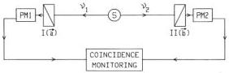

VOLUME 49, NUMBER 25

PHYSICAL REVIEW LETTERS

20 DECEMBER 1982

for trapping as b decreases is reflective of the incorporation of periodic components into the sequence of numbers generated.

To summarize the motivation and principal conclusion of this Letter, we restate¹ that for values of b where numerically generated sequences appear to be chaotic, it has not been settled whether those sequences "are truly chaotic, or whether, in fact, they are really periodic, but with exceedingly large periods and very long transients required to settle down." On the one hand, Grossman and Thomae⁵,⁶ have suggested that (only) the parameter value b = 1 generates pure chaos [see the discussion following Eq. (31) of Ref. 5 and the correlations plotted in their Fig. 9]. On the other hand, for certain other values of b, numerical results of Lorenz (reported in Ref. 1) "strongly suggest that the sequences are truly chaotic." The purpose of this communication was to use an independent and exact result from the statistical-mechanical theory of d = 1 random walks to test the randomness of the parabolic map for parameter values where the existence of "true chaos" is still an open question.

Our results strongly support the conclusions of Grossmann and Thomae.

This research was supported by the Office of Basic Energy Sciences of the U. S. Department of Energy.

(a) Permanent address: Miles Laboratories, Elkhart, Ind. 46652.

(b) Present address: Department of Chemistry, Stanford University, Stanford, Cal. 94305.

¹ E. Ott, Rev. Mod. Phys. 53, 655 (1981).

² C. A. Walsh and J. J. Kozak, Phys. Rev. Lett. 47, 1500 (1981).

³ E. W. Montroll, Proc. Symp. Appl. Math. Am. Math. Soc. 16, 193 (1964); E. W. Montroll and G. W. Weiss, J. Math. Phys. 6, 167 (1965); E. W. Montroll, J. Math. Phys. 10, 753 (1969).

⁴ K. Tomita, in Pattern Formation by Dynamic Systems and Pattern Recognition, edited by H. Haken (Springer-Verlag, Heidelberg, 1979), pp. 90-97.

⁵ S. Thomae and S. Grossmann, J. Stat. Phys. 26, 485 (1981).

⁶ S. Grossmann and S. Thomae, Z. Naturforsch. 32a, 1353 (1977).

### Experimental Test of Bell's Inequalities Using Time-Varying Analyzers

Alain Aspect, Jean Dalibard,⁽ᵃ⁾ and Gérard Roger
Institut d'Optique Théorique et Appliquée, F-91406 Orsay Cédex, France
(Received 27 September 1982)

Correlations of linear polarizations of pairs of photons have been measured with time-varying analyzers. The analyzer in each leg of the apparatus is an acousto-optical switch followed by two linear polarizers. The switches operate at incommensurate frequencies near 50 MHz. Each analyzer amounts to a polarizer which jumps between two orientations in a time short compared with the photon transit time. The results are in good agreement with quantum mechanical predictions but violate Bell's inequalities by 5 standard deviations.

PACS numbers: 03.65.Bz, 35.80.+s

Bell's inequalities apply to any correlated measurement on two correlated systems. For instance, in the optical version of the Einstein-Podolsky-Rosen-Bohm Gedankenexperiment,¹ a source emits pairs of photons (Fig. 1). Measurements of the correlations of linear polarizations are performed on two photons belonging to the same pair. For pairs emitted in suitable states, the correlations are strong. To account for these correlations, Bell² considered theories which invoke common properties of both members of the

FIG. 1. Optical version of the Einstein-Podolsky-Rosen-Bohm Gedankenexperiment. The pair of photons ν₁ and ν₂ is analyzed by linear polarizers I and II (in orientations ā and b̄) and photomultipliers. The coincidence rate is monitored.

1804

© 1982 The American Physical Society