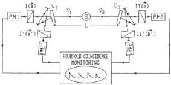

VOLUME 49, NUMBER 25

PHYSICAL REVIEW LETTERS

20 DECEMBER 1982

pair. Such properties are referred to as supplementary parameters. This is very different from the quantum mechanical formalism, which does not involve such properties. With the addition of a reasonable locality assumption, Bell showed that such classical-looking theories are constrained by certain inequalities that are not always obeyed by quantum mechanical predictions.

Several experiments of increasing accuracy have been performed and clearly favor quantum mechanics. Experiments using pairs of visible photons emitted in atomic radiative cascades seem to achieve a good realization of the ideal Gedankenexperiment. However, all these experiments have been performed with static setups, in which polarizers are held fixed for the whole duration of a run. Then, one might question Bell's locality assumption, that states that the results of the measurement by polarizer II does not depend on the orientation a of polarizer I (and vice versa), nor does the way in which pairs are emitted depend on a or b. Although highly reasonable, such a locality condition is not prescribed by any fundamental physical law. As pointed out by Bell, it is possible, in such experiments, to reconcile supplementary-parameter theories and the experimentally verified predictions of quantum mechanics: "The settings of the instruments are made sufficiently in advance to allow them to reach some mutual rapport by exchange of signals with velocity less than or equal to that of light." If such interactions existed, Bell's locality condition would no longer hold for static experiments, nor would Bell's inequalities.

Bell thus insisted upon the importance of "experiments of the type proposed by Bohm and Aharonov, in which the settings are changed during the flight of the particles." In such a "timing experiment," the locality condition would then become a consequence of Einstein's causality, preventing any faster-than-light influence.

In this Letter, we report the results of the first experiment using variable polarizers. Following our proposal, we have used a modified scheme (Fig. 2). Each polarizer is replaced by a setup involving a switching device followed by two polarizers in two different orientations: a and a' on side I, and b and b' on side II. Such an optical switch is able to rapidly redirect the incident light from one polarizer to the other one. If the two switches work at random and are uncorrelated, it is possible to write generalized Bell's inequalities in a form similar to Clauser-Horne-

FIG. 2. Timing experiment with optical switches. Each switching device (C_I, C_II) is followed by two polarizers in two different orientations. Each combination is equivalent to a polarizer switched fast between two orientations.

Shimony-Holt inequalities:

$$- 1 \leqslant S \leqslant 0,$$

with

$$S = \frac{N(\tilde{a}, \tilde{b})}{N(\infty, \infty)} - \frac{N(\tilde{a}, \tilde{b}')}{N(\infty, \infty')} + \frac{N(\tilde{a}', \tilde{b})}{N(\infty', \infty)} + \frac{N(\tilde{a}', \tilde{b}')}{N(\infty', \infty')} - \frac{N(\tilde{a}', \infty)}{N(\infty', \infty)} - \frac{N(\infty, \tilde{b})}{N(\infty, \infty)}.$$

The quantity S involves (i) the four coincidence counting rates [N(ā, b̄), N(ā', b̄), etc.] measured in a single run; (ii) the four corresponding coincidence rates [N(∞, ∞), N(∞', ∞), etc.] with all polarizers removed; and (iii) two coincidence rates [N(ā', ∞), N(∞, b̄)] with a polarizer removed on each side. The measurements (ii) and (iii) are performed in auxiliary runs.

In this experiment, switching between the two channels occurs about each 10 ns. Since this delay, as well as the lifetime of the intermediate level of the cascade (5 ns), is small compared to L/c (40 ns), a detection event on one side and the corresponding change of orientation on the other side are separated by a spacelike interval.

The switching of the light is effected by acousto-optical interaction with an ultrasonic standing wave in water. As sketched in Fig. 3 the incidence angle is equal to the Bragg angle, θ_B = 5 × 10⁻³ rad. It follows that light is either transmitted straight ahead or deflected at an angle 2θ_B. The light is completely transmitted when the amplitude of the standing wave is null, which occurs twice during an acoustical period. A quarter of a period later, the amplitude of the standing wave is maximum and, for a suitable value of the acoustical power, light is then fully

1805