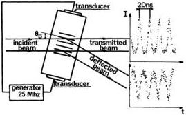
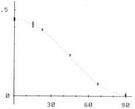

VOLUME 49, NUMBER 25

PHYSICAL REVIEW LETTERS

20 DECEMBER 1982

FIG. 3. Optical switch. The incident light is switched at a frequency around 50 MHz by diffraction at the Bragg angle on an ultrasonic standing wave. The intensities of the transmitted and deflected beams as a function of time have been measured with the actual source. The fraction of light directed towards other diffraction orders is negligible.

deflected. This optical switch thus works at twice the acoustical frequency.

The ultrasonic standing-wave results from interference between counterpropagating acoustic waves produced by two electroacoustical transducers driven in phase at about 25 MHz. In auxiliary tests with a laser beam, the switching has been found complete for an acoustical power about 1 W. In the actual experiment, the light beam has a finite divergence, and the switching is not complete (Fig. 3).

The other parts of the experiment have already been described in previous publications.⁴⁻⁵ The high-efficiency well-stabilized source of pairs of correlated photons, at wavelengths λ₁=422.7 nm and λ₂=551.3 nm, is obtained by two-photon excitation of a (J=0)-(J=1)-(J=0) cascade in calcium.

Since each switch is 6 m from the source, rather complicated optics are required to match the beams with the switches and the polarizers. We have carefully checked each channel for no depolarization, by looking for a cosine Malus law when a supplementary polarizer is inserted in front of the source. These auxiliary tests are particularly important for the channels which involve two mirrors inclined at 11°. They also yield the efficiencies of the polarizers, required for the quantum mechanical calculations.

The coincidence counting electronics involve four double-coincidence-counting circuits with coincidence windows of 18 ns. For each relevant pair of photomultipliers, we monitor nondelayed and delayed coincidences. The true coincidence

FIG. 4. Average normalized coincidence rate as a function of the relative orientation of the polarizers. Indicated errors are ±1 standard deviation. The dashed curve is not a fit to the data but the predictions by quantum mechanics for the actual experiment.

rate (i.e., coincidences due to photons emitted by the same atom) are obtained by subtraction. Simultaneously, a time-to-amplitude converter, followed by a fourfold multichannel analyzer, yields four time-delay spectrums. Here, the true coincidence rate is taken as the signal in the peak of the time-delay spectrum.⁴

We have not been able to achieve collection efficiencies as large as in previous experiments,⁴⁻⁵ since we had to reduce the divergence of the beams in order to get good switching. Coincidence rates with the polarizers removed were only a few per second, with accidental coincidence rates about one per second.

A typical run lasts 12 000 s, involving totals of 4000 s with polarizers in place at a given set of orientations, 4000 s with all polarizers removed, and 4000 s with one polarizer removed on each side. In order to compensate the effects of systematic drifts, data accumulation was alternated between these three configurations about every 400 s. At the end of each 400-s period, the raw data were stored for subsequent processing with the help of a computer.

At the end of the run, we average the true coincidence rates corresponding to the same configurations for the polarizers. We then compute the relevant ratios for the quantity S. The statistical accuracy is evaluated according to standard statistical methods for photon counting. The processing is performed on both sets of data: that obtained with coincidence circuits, and that obtained with the time-to-amplitude converter. The two methods have always been found to be consistent.

1806