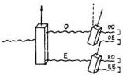
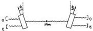

482

Feynman

Fig. 3.

You'll find the following. When a photon comes in, you always find that only one of the four counters goes off.

If the photon is $O$ from the first calcite, then the second calcite gives $O-O$ with probability $\cos^2\phi$ or $O-E$ with the complementary probability $1-\cos^1\phi=\sin^2\phi$. Likewise an $E$ photon gives a $E-O$ with the probability $\sin^2\phi$ or an $E-E$ with the probability $\cos^2\phi$.

### 8. TWO-PHOTON CORRELATION EXPERIMENT

Let us turn now to the two photon correlation experiment (see Figure 4).

What can happen is that an atom emits two photons in opposite direction (e.g., the $3s \to 2p \to 1s$ transition in the H atom). They are observed simultaneously (say, by you and by me) through two calcites set at $\phi_1$ and $\phi_2$ to the vertical. Quantum theory and experiment agree that the probability $P_{OO}$ that both of us detect an ordinary photon is

$$P_{OO} = \frac{1}{2} \cos^2(\phi_2 - \phi_1)$$

The probability $P_{EE}$ that we both observe an extraordinary ray is the same

$$P_{EE} = \frac{1}{2} \cos^2(\phi_2 - \phi_1)$$

The probability $P_{OE}$ that I find $O$ and you find $E$ is

$$P_{OE} = \frac{1}{2} \sin^2(\phi_2 - \phi_1)$$

Fig. 4.