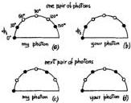

484

Feynman

On each diagram (Figure 5) are the angles $0^{\circ}$, $30^{\circ}$, $60^{\circ}$, $90^{\circ}$, $120^{\circ}$, and $150^{\circ}$. A particle comes out to me, and it's in some sort of state, so what it's going to give for $0^{\circ}$, for $30^{\circ}$, etc. are all predicted—determined—by the state. Let us say that in a particular state that is set up the prediction for $0^{\circ}$ is that it'll be extraordinary (black dot), for $30^{\circ}$ it's also extraordinary, for $60^{\circ}$ it's ordinary (white dot), and so on (Figure 5a). By the way, the outcomes are complements of each other at right angles, because, remember, it's always either extraordinary or ordinary; so if you turn $90^{\circ}$, what used to be an ordinary ray becomes the extraordinary ray. Therefore, whatever condition it's in, it has some predictive pattern in which you either have a prediction of ordinary or of extraordinary—three and three—because at right angles they're not the same color. Likewise the particle that comes to you when they're separated must have the same pattern because you can determine what I'm going to get by measuring yours. Whatever circumstances come out, the patterns must be the same. So, if I want to know, Am I going to get white at $60^{\circ}$? You just measure at $60^{\circ}$, and you'll find white, and therefore you'll predict white, or ordinary, for me. Now each time we do the experiment the pattern may not be the same. Every time we make a pair of photons, repeating this experiment again and again, it doesn't have to be the same as Figure 5a. Let's assume that the next time the experiment my photon will be $O$ or $E$ for each angle as in Figure 5c. Then your pattern looks like Figure 5d. But whatever it is, your pattern has to be my pattern exactly—otherwise you couldn't predict what I was going to get exactly by measuring the corresponding angle. And so on. Each time we do the experiment, we get different patterns; and it's easy: there are just six dots and three of them are white, and you chase them around different way—everything can happen. If we measure at the same angle, we always find that with this kind of arrangement we would get the same result.

Now suppose we measure at $\phi_2 - \phi_1 = 30^{\circ}$, and ask, With what probability do we get the same result? Let's first try this example here (Figure 5a, 5b). With what probability would we get the same result, that they're

Fig. 5.