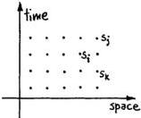

470

Feynman

Fig. 1.

You'll notice immediately that if this particular function is such that the value of the function at i only involves the few points behind in time, earlier than this time i, all I've done is to redescribe the cellular automaton, because it means that you calculate a given point from points at earlier times, and I can compute the next one and so on, and I can go through this in that particular order. But just let's us think of a more general kind of computer, because we might have a more general function. So let's think about whether we could have a wider case of generality of interconnections of points in space-time. If F depends on all the points both in the future and the past, what then? That could be the way physics works. I'll mention how our theories go at the moment. It has turned out in many physical theories that the mathematical equations are quite a bit simplified by imagining such a thing—by imagining positrons as electrons going backwards in time, and other things that connect objects forward and backward. The important question would be, if this computer were laid out, is there in fact an organized algorithm by which a solution could be laid out, that is, computed? Suppose you know this function F_i and it is a function of the variables in the future as well. How would you lay out numbers so that they automatically satisfy the above equation? It may not be possible. In the case of the cellular automaton it is, because from a given row you get the next row and then the next row, and there's an organized way of doing it. It's an interesting question whether there are circumstances where you get functions for which you can't think, at least right away, of an organized way of laying it out. Maybe sort of shake it down from some approximation, or something, but it's an interesting different type of computation.

Question: "Doesn't this reduce to the ordinary boundary value, as opposed to initial-value type of calculation?"

Answer: "Yes, but remember this is the computer itself that I'm describing."

It appears actually that classical physics is causal. You can, in terms of the information in the past, if you include both momentum and position, or